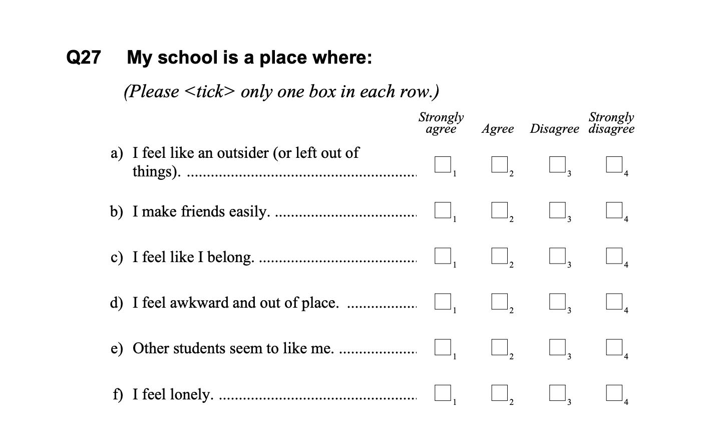
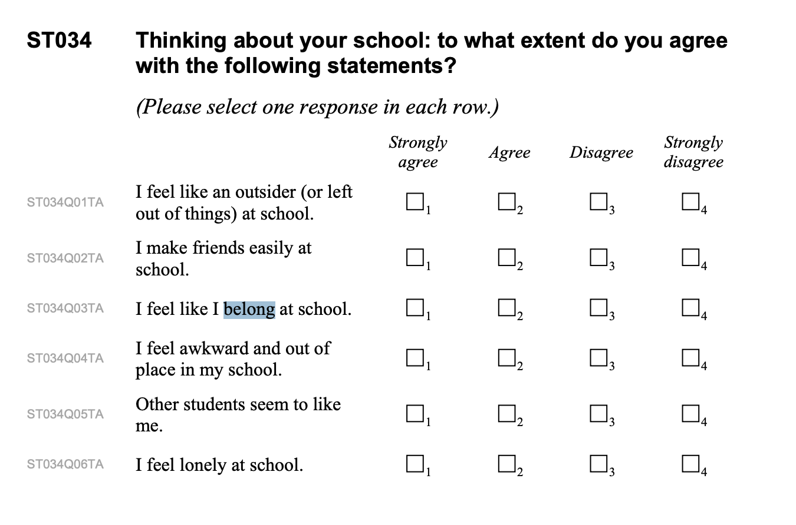
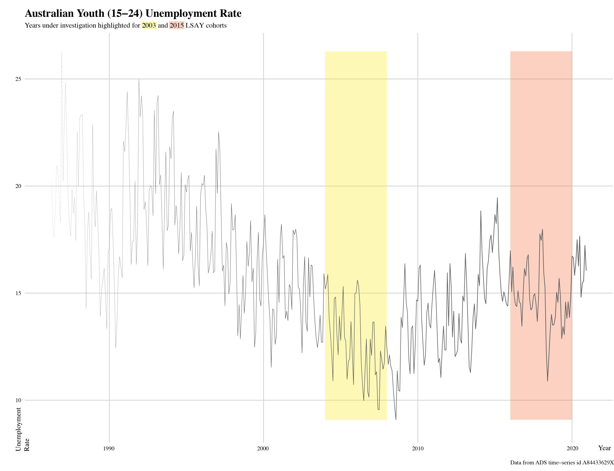

```{r include=FALSE}
knitr::opts_chunk$set(warning = FALSE, message = FALSE, echo = FALSE, dpi = 300)
library(targets)
library(tidyverse)
library(fuzzyjoin)
library(papaja)
library(broom.mixed)
library(mitml)
options(tidyverse.quiet = TRUE)

vcov.geeglm <- function(x) summary(x)$cov.scaled

# Name Cleaner
name_cleaner <- dplyr::tribble(
  ~r_word, ~Parameter,
  "(Intercept)", "Intercept",
  "belong", "School Belonging (SD Units)",
  "year", "Time Wave (1-Year Units)",
  "pc", "Achievement (SD Units)",
  "escs", "SES (SD Units)",
  "sex", "Gender",
  "loc", "Urban",
  "indig", "Indigenous",
  "immig", "Immigrant",
  "sch_escs", "School Avgerage SES (SD Units)",
  "sch_pc", "School Avgerage Achievement (Sd Units)",
  "cohortcohort_2015", "Cohort (2015)",
  "Intercept~~Intercept|schid", "Random Intercept: School",
  "Intercept~~Intercept|id", "Random Intercept: Individual",
  "Residual~~Residual", "Residual Variance",
  "ICC|schid", "School ICC",
  "sch_grad", "High-School Graduate",
  "egpsalariat", "Social class: Salariat",
  "egpworking", "Social class: Working"
)
```

# Belonging Question (As they appear in the Student Questionnaire)

## PISA 2003



## PISA 2015



# Social Class Results

(ref:neet-soc) Model Predicting NEET Status (Including Social Class).

```{r results='asis'}
targets::tar_load(neet_socclass)
model1 <- neet_socclass$summary
c <- model1$estimate
ci <- confint(model1)

c <- bind_cols(c %>% as_tibble(rownames = "Parameter"), ci %>% as_tibble()) %>%
  mutate(Estimate=exp(Estimate),
         `2.5 %`=exp(`2.5 %`),
         `97.5 %`=exp(`97.5 %`)
  )

r <- model1$var.comp %>% as_tibble(rownames = "Parameter")

bind_rows(c,r) %>% 
  select(Term = Parameter, `Odds Ratio` = Estimate, `-95% CI` = `2.5 %`,
         `+95% CI` = `97.5 %`) %>%
  fuzzyjoin::stringdist_left_join(.,name_cleaner, by = c(Term = "r_word")) %>%
  relocate(Parameter, .before = "Term") %>%
  select(-Term,-r_word) %>%
  printnum(na_string = "") %>%
  apa_table(caption = "(ref:neet-soc)",
            note = "Random intercepts are not in odds-ratio units. Intermediate class is reference class.")

```

# Generalized Estimating Equation Results

(ref:neet-gee) Model Predicting NEET Status (GEE Model).

```{r results='asis'}
targets::tar_load(neet_gee)
model1 <- neet_gee$summary
c <- model1$estimate
ci <- confint(model1)

c <- bind_cols(c %>% as_tibble(rownames = "Parameter"), ci %>% as_tibble()) %>%
  mutate(Estimate=exp(Estimate),
         `2.5 %`=exp(`2.5 %`),
         `97.5 %`=exp(`97.5 %`)
  )

r <- model1$var.comp %>% as_tibble(rownames = "Parameter")

bind_rows(c,r) %>% 
  select(Term = Parameter, `Odds Ratio` = Estimate, `-95% CI` = `2.5 %`,
         `+95% CI` = `97.5 %`) %>%
  fuzzyjoin::stringdist_left_join(.,name_cleaner, by = c(Term = "r_word")) %>%
  relocate(Parameter, .before = "Term") %>%
  select(-Term,-r_word) %>%
  printnum(na_string = "") %>%
  apa_table(caption = "(ref:neet-gee)",
            note = "Random intercepts are not in odds-ratio units. ")

```


# School Context: Average Achievement

(ref:sch-ach-model) Model Predicting NEET (School Average Achievement).

```{r results='asis'}
targets::tar_load(neet_sch_ach)
model1 <- neet_sch_ach$summary
c <- model1$estimate
ci <- confint(model1)

c <- bind_cols(c %>% as_tibble(rownames = "Parameter"), ci %>% as_tibble()) %>%
  mutate(Estimate=exp(Estimate),
         `2.5 %`=exp(`2.5 %`),
         `97.5 %`=exp(`97.5 %`)
  )

r <- model1$var.comp %>% as_tibble(rownames = "Parameter")

bind_rows(c,r) %>% 
  select(Term = Parameter, `Odds Ratio` = Estimate, `-95% CI` = `2.5 %`,
         `+95% CI` = `97.5 %`) %>%
  fuzzyjoin::stringdist_left_join(.,name_cleaner, by = c(Term = "r_word")) %>%
  relocate(Parameter, .before = "Term") %>%
  select(-Term,-r_word) %>%
  printnum(na_string = "") %>%
  apa_table(caption = "(ref:sch-ach-model)",
            note = "Random intercepts are not in odds-ratio units. ")

```

# School Context: Average Achievement

(ref:sch-ses-model) Model Predicting NEET (School Average SES).

```{r results='asis'}
targets::tar_load(neet_sch_ses)
model1 <- neet_sch_ses$summary
c <- model1$estimate
ci <- confint(model1)

c <- bind_cols(c %>% as_tibble(rownames = "Parameter"), ci %>% as_tibble()) %>%
  mutate(Estimate=exp(Estimate),
         `2.5 %`=exp(`2.5 %`),
         `97.5 %`=exp(`97.5 %`)
  )

r <- model1$var.comp %>% as_tibble(rownames = "Parameter")

bind_rows(c,r) %>% 
  select(Term = Parameter, `Odds Ratio` = Estimate, `-95% CI` = `2.5 %`,
         `+95% CI` = `97.5 %`) %>%
  fuzzyjoin::stringdist_left_join(.,name_cleaner, by = c(Term = "r_word")) %>%
  relocate(Parameter, .before = "Term") %>%
  select(-Term,-r_word) %>%
  printnum(na_string = "") %>%
  apa_table(caption = "(ref:sch-ses-model)",
            note = "Random intercepts are not in odds-ratio units. ")

```

# Predicting School Graduation

(ref:sch-grad-model) Model Predicting High-School Graduation Status.

```{r results='asis'}
targets::tar_load(sch_grad_model)
model1 <- sch_grad_model$summary
c <- model1$estimate
ci <- confint(model1)

c <- bind_cols(c %>% as_tibble(rownames = "Parameter"), ci %>% as_tibble()) %>%
  mutate(Estimate=exp(Estimate),
         `2.5 %`=exp(`2.5 %`),
         `97.5 %`=exp(`97.5 %`)
  )

r <- model1$var.comp %>% as_tibble(rownames = "Parameter")

bind_rows(c,r) %>% 
  select(Term = Parameter, `Odds Ratio` = Estimate, `-95% CI` = `2.5 %`,
         `+95% CI` = `97.5 %`) %>%
  fuzzyjoin::stringdist_left_join(.,name_cleaner, by = c(Term = "r_word")) %>%
  relocate(Parameter, .before = "Term") %>%
  select(-Term,-r_word) %>%
  printnum(na_string = "") %>%
  apa_table(caption = "(ref:sch-grad-model)",
            note = "Random intercepts are not in odds-ratio units. ")

```


# Unemployment Rate



